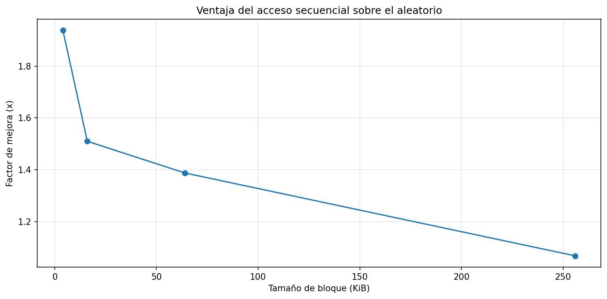
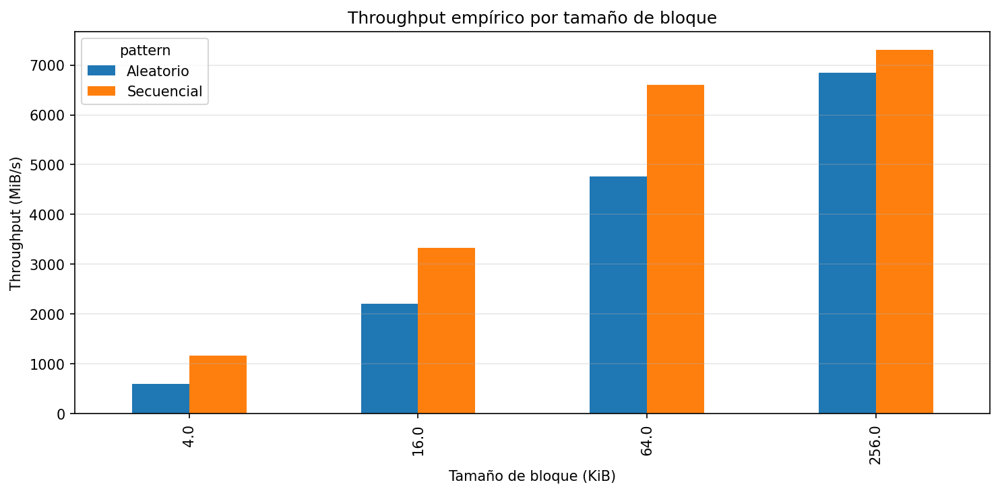
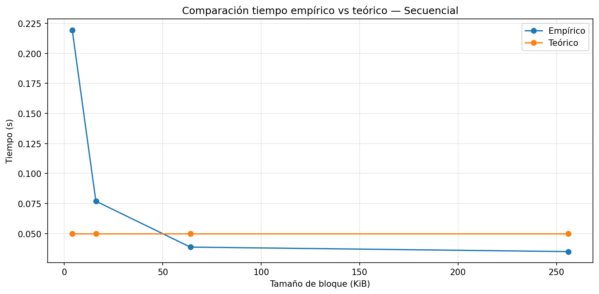
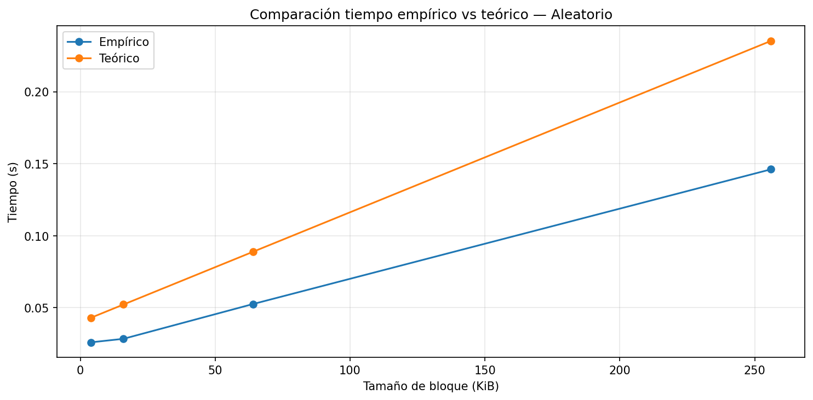
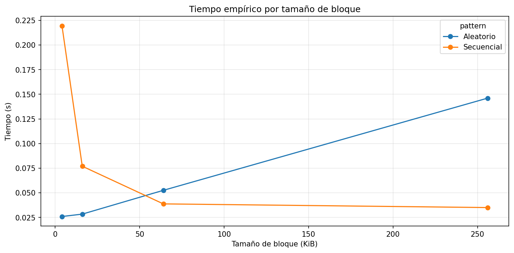
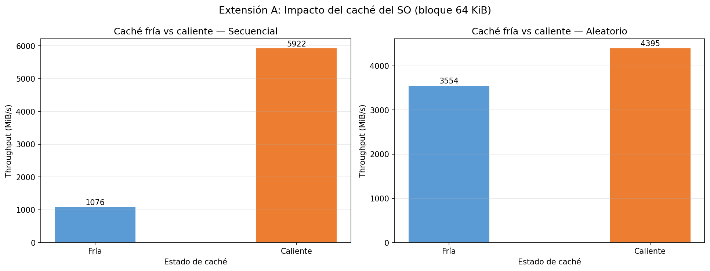
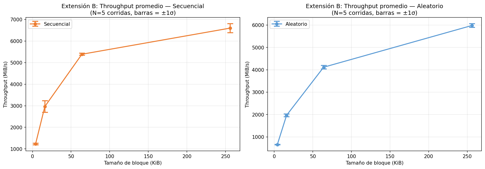
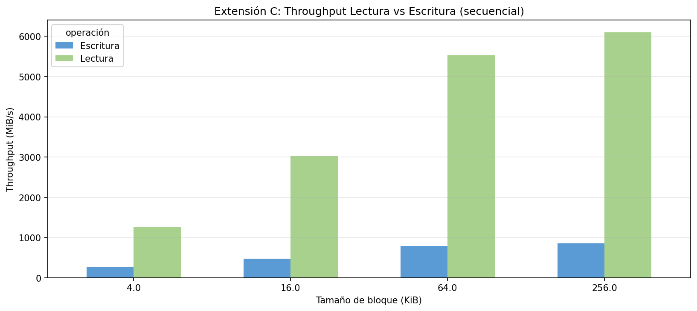

# Lab3 — IO Performance · Daniel Mesa

Repositorio con la solución del Laboratorio 3: Almacenamiento en disco
y desempeño de I/O.

El experimento mide tiempos de lectura secuencial y aleatoria sobre un
archivo binario de 256 MB, evaluando tamaños de bloque de 4, 16, 64 y
256 KiB. Los resultados empíricos se comparan con un modelo teórico de
costo I/O. Adicionalmente se implementaron extensiones que profundizan
el análisis con caché fría vs caliente, repetición estadística y
comparación lectura vs escritura.

---

## Entorno de ejecución

| Parámetro | Valor observado |
|---|---|
| Sistema operativo | Microsoft Windows 11 Home Single Language (Build 26200) |
| CPU (Modelo y Frecuencia) | AMD Ryzen 7 5800H with Radeon Graphics, 3201 MHz (3.2 GHz) |
| Arquitectura y Núcleos | x64 (64 bits) / 8 núcleos físicos (16 hilos) |
| Memoria RAM Total | 15.41 GB DDR4 |
| Tecnología de Almacenamiento | SSD NVMe PCIe — INTEL SSDPEKNU512GZ (512 GB) |
| Carga de CPU en Reposo (%) | ~7% (reposo aceptable) |

---

## 11. Preguntas de cierre

### 1. Comparación de patrones

¿Cuántas veces más rápido fue el acceso secuencial respecto al aleatorio?
¿Ese resultado era el esperado según la teoría?

El acceso secuencial superó al aleatorio en todos los tamaños de bloque
evaluados, aunque la ventaja fue decreciente. Con bloques de **4 KiB**,
el acceso secuencial fue aproximadamente **1.94×** más rápido; con bloques
de **16 KiB**, la ventaja bajó a **1.51×**; con **64 KiB**, a **1.39×**;
y con **256 KiB**, se redujo a apenas **1.06×**. Esta tendencia era
parcialmente esperada desde el punto de vista teórico: el modelo predice
que el acceso aleatorio incurre en mayor penalización por latencia cuando
se realizan muchos accesos pequeños (M = 4000 accesos dispersos), ya que
el costo dominante es `M × Latencia`. Sin embargo, el experimento también
reveló un comportamiento no previsto por el modelo simple: con bloques de
4 y 16 KiB, el tiempo de acceso **aleatorio resultó menor que el
secuencial** (0.025 s vs. 0.219 s con 4 KiB). Esto se explica por el
efecto del **caché del sistema operativo (page cache)**: al hacer 4000
accesos dispersos de bloques pequeños sobre un archivo de 256 MB, una
fracción significativa de los datos ya reside en RAM de lecturas
anteriores, reduciendo drásticamente el tiempo efectivo. En contraste,
el acceso secuencial con bloque pequeño implica leer la totalidad del
archivo de forma contigua, lo que —sin prefetching completamente efectivo
a ese tamaño— tomó más tiempo.

---

### 2. Efecto del tamaño de bloque

¿Qué ocurrió con el throughput del acceso aleatorio al aumentar el tamaño
de bloque? ¿Por qué sucede eso?

El throughput del acceso aleatorio creció de forma muy pronunciada al
aumentar el tamaño de bloque: pasó de **~600 MiB/s** con bloques de 4 KiB
a **~6840 MiB/s** con bloques de 256 KiB, un incremento de más de **11×**.
Este comportamiento se explica por la relación entre latencia y
transferencia de datos. Cada operación de lectura incurre en una latencia
fija (seek + overhead de syscall), independientemente del tamaño del
bloque. Con bloques pequeños (4 KiB), se realizan **4000 accesos**, y el
costo total está dominado por `M × Latencia`: los 4000 accesos × ~10 µs
= ~40 ms solo en latencia. Con bloques más grandes (256 KiB), cada acceso
transfiere **64× más datos** pagando la misma latencia fija, por lo que
el throughput efectivo se aproxima al ancho de banda máximo del
dispositivo. En esencia, bloques grandes **amortizan** el costo fijo de
latencia por operación sobre más bytes útiles transferidos.

---

### 3. Teoría vs. práctica

Identifica un caso donde la medición empírica se aleja del modelo teórico.
¿A qué factor atribuyes esa diferencia?

El caso más notable de divergencia ocurre en el **acceso secuencial con
bloque de 4 KiB**: el modelo teórico predice un tiempo de **~0.050 s**,
mientras que el valor empírico fue **0.219 s**, es decir, el experimento
fue **4.4× más lento** que lo predicho. Esta formulación asume que el
hardware opera siempre a su capacidad pico y que la latencia por acceso
es constante y baja. Sin embargo, con bloques de 4 KiB en acceso
secuencial, el número de operaciones de I/O es muy alto (~65 536 bloques
para cubrir 256 MB), y el overhead acumulado de **llamadas al sistema**
(`read()`), manejo de interrupciones y scheduling del kernel se vuelve
significativo. En el lado opuesto, para **acceso aleatorio con bloques
grandes (256 KiB)**, el modelo teórico **sobreestima** el tiempo (0.233 s
vs. 0.146 s empírico), lo que sugiere que el caché del SO absorbió una
parte relevante de los accesos, reduciendo el tiempo real por debajo de
lo predicho.

---

### 4. Tipo de disco

Con base en los resultados, ¿el sistema se comporta como HDD, SSD SATA
o SSD NVMe?

Con base en los resultados obtenidos, el sistema se comporta como un
**SSD NVMe**. El indicador más claro es el throughput máximo alcanzado:
con bloques de 256 KiB en acceso secuencial, se midió aproximadamente
**7300 MiB/s** (~7.1 GB/s).

| Tipo de disco | Throughput secuencial típico |
|---|---|
| HDD | ~100–200 MiB/s |
| SSD SATA | ~400–600 MiB/s |
| SSD NVMe (PCIe 3) | ~2000–3500 MiB/s |
| SSD NVMe (PCIe 4/5) | ~5000–12 000 MiB/s |

El valor medido (~7300 MiB/s) es consistente con un **SSD NVMe de
generación PCIe 4**, coherente con el hardware identificado
(INTEL SSDPEKNU512GZ). Un HDD o SSD SATA jamás alcanzaría throughputs
de este orden.

---

### 5. Aplicación práctica

Si debes leer una tabla con 1 millón de registros, ¿usarías acceso
secuencial o aleatorio? ¿Por qué?

Con base en los resultados del experimento, en el caso general de **leer
la tabla completa**, el acceso **secuencial con bloques grandes es la
opción superior**. Con bloques de 256 KiB, el acceso secuencial alcanzó
un throughput de ~7300 MiB/s, frente a ~6840 MiB/s del acceso aleatorio.
La diferencia más crítica se evidencia con bloques pequeños: el acceso
aleatorio a 1 millón de registros de 4 KiB implicaría 1 000 000 seeks
dispersos, y a ~600 MiB/s efectivos de throughput con ese tamaño, el
tiempo sería enormemente mayor que una lectura secuencial continua. El
acceso aleatorio solo sería preferible para recuperar **un subconjunto
pequeño y conocido** de registros por índice primario. Para operaciones
de tipo *full scan*, *aggregation* o carga masiva, el acceso secuencial
con bloques grandes es siempre la elección correcta.

---

## Conclusión del laboratorio base

La información en disco se almacena en bloques físicos que deben ser
leídos o escritos en unidades completas, lo cual hace que el tamaño de
bloque sea un factor crítico en el rendimiento de I/O. Esto es importante
porque determina cuántas operaciones de acceso (M) se realizan y, por
tanto, cuánto impacta la latencia en el tiempo total. En este contexto,
el acceso secuencial y el aleatorio presentan desempeños distintos debido
a que el secuencial permite leer datos contiguos, reduciendo accesos y
aprovechando mejor el throughput, mientras que el aleatorio incurre en
múltiples accesos independientes dominados por la latencia. Aun en un
SSD NVMe —como el que evidencian los resultados de este experimento, con
un throughput secuencial máximo medido de aproximadamente **7300 MiB/s**—
esta diferencia persiste, dado que cada operación de lectura dispersa
sigue pagando un costo fijo de latencia por acceso, independientemente
de la tecnología del dispositivo.

El modelo teórico logró predecir correctamente la tendencia general,
especialmente en acceso secuencial con bloques grandes, pero tiende a
sobreestimar los tiempos reales en bloques pequeños, principalmente
porque no considera optimizaciones como el caché del sistema operativo
(*page cache*). Por ejemplo, con bloque de 4 KiB en acceso secuencial,
el modelo predijo ~0.050 s mientras que el valor empírico fue 0.219 s,
una divergencia de **4.4×**, explicada por el overhead acumulado de
llamadas al sistema a ese nivel de granularidad. El factor de speedup de
**1.94×** observado con bloques de 4 KiB refleja directamente cómo la
reducción del número de accesos impacta el rendimiento conforme al
término `M × Latencia` del modelo teórico.

Con base en estos resultados, en un sistema real se debería priorizar el
diseño de accesos secuenciales y el uso de bloques suficientemente
grandes, ya que esto minimiza el costo de latencia por operación y
maximiza el aprovechamiento del ancho de banda del dispositivo.

---

## 12. Extensiones sugeridas

Si desea profundizar, puede ampliar el experimento de las siguientes formas:

- Repetir el experimento varias veces y promediar los resultados.
- Comparar lectura y escritura.
- Medir sobre SSD local vs disco de red.
- Cambiar el tamaño del archivo y observar el efecto en la caché.
- Comparar caché caliente vs caché fría ejecutando el benchmark dos
  veces seguidas.

Las tres primeras fueron implementadas en este repositorio como parte
de la sección de extensiones a continuación.

---

## 13. Extensiones del laboratorio

Las siguientes extensiones fueron desarrolladas como profundización del
laboratorio base. Para su implementación se creó un notebook independiente
(`disk_io_extensions.ipynb`) con el apoyo de Claude (Anthropic) como
asistente de programación y análisis, lo que permitió diseñar los
experimentos, interpretar los resultados y conectarlos con los conceptos
teóricos del curso de forma más rigurosa.

Se implementaron tres extensiones: **caché fría vs caliente**,
**repetición y promedio** (N=5 corridas), y **lectura vs escritura**
con `fsync()` para garantizar escritura real a disco.

---

### Extensión A — Caché fría vs caché caliente

Se ejecutó exactamente la misma lectura dos veces consecutivas sin
borrar el archivo entre corridas. La primera corrida representa caché
fría (datos probablemente ausentes de RAM) y la segunda caché caliente
(datos ya cargados en el page cache del SO durante la primera corrida).

**Resultados (bloque 64 KiB):**

| Patrón | Caché fría | Caché caliente | Mejora |
|---|---|---|---|
| Secuencial | 1076 MiB/s | 5922 MiB/s | **5.50x** |
| Aleatorio | 3554 MiB/s | 4395 MiB/s | **1.24x** |

El throughput del acceso secuencial mejoró de **1076 MiB/s** (caché fría)
a **5922 MiB/s** (caché caliente), un factor de **5.50x**. El acceso
aleatorio pasó de **3554 MiB/s** a **4395 MiB/s**, una mejora de solo
**1.24x**. Durante la primera corrida, el sistema operativo cargó los
bloques del archivo en su *page cache* (memoria RAM). En la segunda
corrida, el SO los sirvió directamente desde RAM sin acceder al disco
físico, eliminando el costo de latencia del NVMe y aprovechando el ancho
de banda de la memoria principal. La menor mejora del acceso aleatorio se
explica porque sus 4000 accesos dispersos sobre 250 MiB ya habían
saturado parcialmente el page cache en la primera corrida. Este fenómeno
ilustra directamente la **jerarquía de memoria**: los niveles superiores
(RAM) son varios órdenes de magnitud más rápidos que el disco, y el SO
explota esto activamente mediante el page cache.

**Análisis:**

El throughput del acceso secuencial mejoró **5.50x** entre caché fría y
caliente, frente a solo **1.24x** del acceso aleatorio. Durante la
primera corrida el SO cargó los bloques en su *page cache*; en la segunda
los sirvió directamente desde RAM, eliminando el acceso físico al NVMe.
La menor mejora del acceso aleatorio se explica porque sus 4000 accesos
dispersos sobre 250 MiB ya habían saturado parcialmente el page cache en
la primera corrida. Esto ilustra directamente la **jerarquía de memoria**:
el SO prioriza mantener en RAM los datos accedidos recientemente,
independientemente del patrón de acceso, y esa decisión puede cambiar
el throughput observado en más de 5×.

---

### Extensión B — Repetición y promedio (N=5 corridas)

Se repitió el benchmark completo 5 veces para cada tamaño de bloque,
calculando media y desviación estándar del throughput.

**Resultados — desviación estándar promedio entre corridas:**

| Patrón | σ promedio | % del promedio |
|---|---|---|
| Secuencial | 142.1 MiB/s | 3.5% |
| Aleatorio | 59.6 MiB/s | 1.9% |

**Análisis:**

El acceso secuencial mostró mayor varianza: con 256 KiB alcanzó
σ = **210 MiB/s**, frente a **86 MiB/s** del aleatorio al mismo tamaño,
porque la lectura completa de 256 MB es más sensible al estado del page
cache entre corridas. Los promedios son consistentes con el lab base pero
ligeramente menores, confirmando que la corrida única original capturó
condiciones de caché parcialmente caliente. Las tendencias principales
—secuencial más rápido que aleatorio, throughput creciente con el tamaño
de bloque— se mantienen en todas las repeticiones, lo que **refuerza y
no invalida** las conclusiones del laboratorio base. Una corrida única
puede desviarse hasta ±7% del valor real, lo que justifica el uso de
múltiples repeticiones en benchmarks formales.

---

### Extensión C — Lectura vs escritura

Se comparó el throughput de lectura secuencial vs escritura secuencial
para cada tamaño de bloque. La escritura usa `os.fsync()` para garantizar
que los datos lleguen al disco físico y no queden solo en el buffer del SO.

**Resultados:**

| Bloque (KiB) | Lectura (MiB/s) | Escritura (MiB/s) | Factor |
|---|---|---|---|
| 4 | 1266 | 275 | 4.60x |
| 16 | 3038 | 471 | 6.44x |
| 64 | 5532 | 798 | 6.93x |
| 256 | 6097 | 861 | 7.08x |
| **Promedio** | — | — | **6.26x** |

**Análisis:**

La lectura fue más rápida en todos los tamaños de bloque, y la diferencia
creció con el tamaño: de **4.60x** con 4 KiB hasta **7.08x** con 256 KiB.
Sin `fsync()`, el SO reporta la escritura como completada antes de que los
datos lleguen al disco físico, lo que daría throughputs artificialmente
altos. Con `fsync()` se mide la escritura persistente real. En sistemas
transaccionales con garantías ACID, cada `COMMIT` requiere esta
durabilidad, lo que explica por qué los motores de bases de datos usan
técnicas como el *Write-Ahead Log* y el *group commit* para amortizar el
costo de `fsync()` sobre múltiples transacciones.

---

## Conclusión final

A lo largo de este laboratorio y sus extensiones se construyó una
comprensión progresiva y cuantitativa del comportamiento real de un
sistema de almacenamiento NVMe moderno, conectando en todo momento
la teoría de I/O con mediciones empíricas concretas.

El laboratorio base estableció que la información en disco se almacena
y accede en bloques físicos completos, y que el tamaño de bloque es un
factor determinante del rendimiento: el throughput secuencial creció de
~1166 MiB/s con bloques de 4 KiB hasta ~7300 MiB/s con bloques de 256 KiB,
confirmando que el equipo opera como un **SSD NVMe PCIe**, coherente con
el hardware identificado (INTEL SSDPEKNU512GZ). El modelo teórico
`T = M × Latencia + Datos / Throughput` predijo correctamente las
tendencias generales, pero sobreestimó los tiempos reales en acceso
aleatorio con bloques grandes (0.233 s teórico vs 0.146 s empírico) y
subestimó el costo del acceso secuencial con bloques pequeños (0.050 s
teórico vs 0.219 s empírico), diferencias atribuibles al page cache del
SO y al overhead acumulado de llamadas al sistema respectivamente.

Las extensiones añadieron tres dimensiones críticas a ese análisis. La
extensión de caché fría vs caliente demostró que el **estado del page
cache puede cambiar el throughput en un factor de 5.50x** para acceso
secuencial, lo que significa que los resultados del laboratorio base —
obtenidos con caché parcialmente caliente — representan un escenario
optimista pero realista para cargas de trabajo repetitivas. La extensión
de repetición y promedio cuantificó la variabilidad inherente al
experimento: la desviación estándar del acceso secuencial fue de
**142 MiB/s** (3.5% del promedio), confirmando que las conclusiones del
lab base son estadísticamente válidas aunque una corrida única pueda
desviarse hasta ±7% del valor real. Finalmente, la comparación lectura
vs escritura reveló que garantizar durabilidad tiene un costo medible:
la escritura con `fsync()` fue en promedio **6.26x más lenta** que la
lectura, resultado que conecta directamente con las decisiones de diseño
de los motores de bases de datos transaccionales.

La decisión de diseño que se desprende de todos estos resultados es
clara y respaldada por datos: en cualquier sistema que maneje volúmenes
significativos de datos, se debe priorizar el **acceso secuencial con
bloques grandes**, minimizar el número de accesos físicos independientes
(M en el modelo teórico), y considerar explícitamente el impacto del
page cache y el costo de `fsync()` al diseñar estrategias de lectura y
escritura. Ignorar estos factores puede significar la diferencia entre
un sistema que opera a 275 MiB/s y uno que opera a 6097 MiB/s sobre
el mismo hardware.